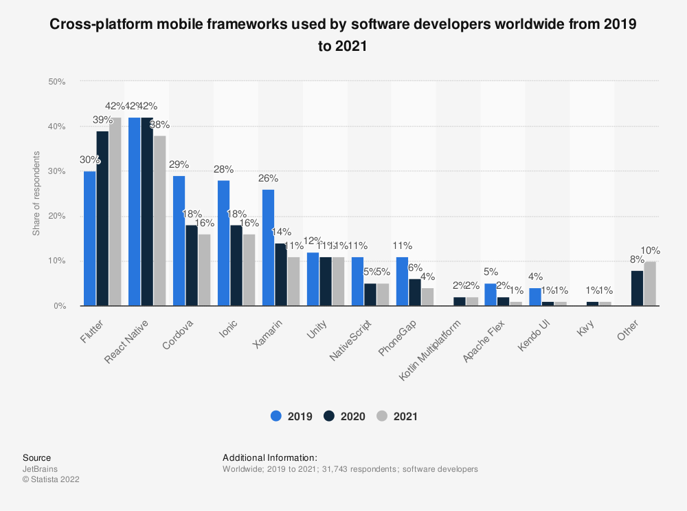

---

author: "lookee"
title: "the best framework you'll ever use for your next web development project"
date: "2022-10-19"
description: "sometimes the coolest isn't the best"
tags: ["technology", "development"]
categories: ["Thoughts"]
aliases: ["web"]
ShowToc: true
TocOpen: true
weight: 2

---

At some point, I decided to get myself a blog. A place to get things I do displayed, elaborate on thoughts and organize my ideas somewhere more coherent than my mind.

So far, this is my second post, but I'm sure I could have written more by now. This is an issue that has become obvious and almost concerning at times for me: I'll often waste more time setting up things than actually getting them done. I'm actually proud of writing this second post, shows how far I've come on this project. Even if I took some time to set this up, I could have actually taken a lot longer. This is because of a recent change in my mindset that I believe will be very beneficial to me both now and in the future.

## Web Technologies

I'll take web development as an example here as it's the area in which I have the most insights, so I do not claim that those problems are the same in every other part of the software development industry.

Web technology is a *very* active department. The web is everywhere you look, and apart from backends, it's based on our old, ever-evolving language set: HTML, CSS and JavaScript. Some may say that other forms of application development have grown and taken space in the industry, such as those used to build mobile apps. But the truth is that developers seem to really like HTML, CSS and JS. Take a look at the top frameworks used for mobile development below. (by the way, there are a lot of those, right?)

If you intend to distribute your app to at least two different platforms, like Android and iOS (which is very likely), you'll benefit a lot from using one of those cross-platforms. Among those, you see: *React* Native, Cordova, Ionic, NativeScript, PhoneGap. Together they had a majority of the market share last year.  Even if there's a rise of applications that use the new Flutter UI framework, your old web stack still dominates the market.

Also, as you might know, JavaScript also takes its share in the world of desktop applications. Electron is a framework that uses Chrome's V8 engine to essentially run a web browser window with access to Node.JS APIs. A polarizing approach, for sure, but it's an idea that had great success.
  
Yes, this is the biggest user client development ecosystem out there, and as you might expect, it gives you a wide array of options on frameworks, libraries and platforms to build on. Sounds great, right?

## Dependency hell, but not as you think

It's very easy to get lost in the sea of frameworks available. New products arrive to solve problems and make earlier products obsolete, so each new framework is labeled as the future of development, marketed with the promise that it will solve your problems as a developer while also providing a better experience for the end user.

When a developer with enough willpower decides that a solution isn't good enough, they'll try to *create* another solution. Hence, this well-known [xkcd](https://xkcd.com/) comic comes to play:

It's good that there are strong, bold people willing to bring change to the way software is made and improve it, and it's what drives it all forward. But in a situation like this, you have to be careful.

## Taking things out of paper

I wanted to create a blog. The first thing that came to mind was some kind of SSG (Static Site Generator) solution. So I started to search for the best frameworks out there. I would not need any kind of fancy WYSIWYG editor or database management since I would be in control of everything from code to content. Then you have Next.JS, Nuxt, VuePress, Jekyll, Gatsby, VitePress, and the list goes on. I mean it [*really goes on*](https://jamstack.org/generators/). My requirements were good TypeScript support, CSS pre-processor support and good project structure. I also wanted to learn more about Vue, since it's a trending option. So I chose Nuxt: good content generation and full control of the layout using Vue.

When I started setting up my project, the first decision I had to make was whether to use Nuxt version 2 or 3. Version 2 was the stable one, built using JS. As soon as I scaffolded a TypeScript project using the provided CLI tool and started making a layout, I ran into some problems. Later on, unsatisfied with everything, I considered using Nuxt 3 (release candidate). Digging through incomplete documentation and solving project setup issues, I could finally start designing my blog.

At that point I was burned out, and started wondering if I would even have content to write for this. So I left everything aside for some days.

A few days later, some vague ideas about art crossed my mind and I felt like writing about it. "Oh! Such a good topic for a blog post!" I thought. But there was no blog.

This time I knew I had to do it fast. So now I was looking for the easiest possible thing that could be set up in the least amount of time. Quickly, remembered about Jekyll, which I had seen while exploring GitHub features some time ago. By googling about Jekyll, I quickly found Hugo, which was supposedly Jekyll but faster. Because I wouldn't have to worry about implementation at first, that was it. In a few minutes I had a Hugo project set up with a cool pre-made theme. Just had to fill in my information and start writing right away. Now I had no components layout structure, TypeScript or node packages. But I had what was most important: a blog. I'm still in the process of customizing this site, making it prettier and adding a personal look, but I'm sure it won't be hard.

## Stick to your goals

Web development has a very big community, and therefore, a lot of options are given to you as a developer to choose from when you need to get a job done. But always remember to set yourself a goal and stick to it, otherwise your productivity will go downhill. If you want to learn about a new framework, it's best to make something *for the sake of learning about a new framework*, and reserve your time specifically to that.

# Getting the job done

Depending on what you are trying to do, you have to consider a number of factors to choose the best tool for your needs. And the first one is:

- How much time do you actually have (or should use) to find the best solution?

Don't forget about your goals. Sometimes you just need a simple tool for a simple job, like I did when making this blog. Otherwise, if you're going to work in a big project or work with other developers, making a thoughtful choice will be useful in the long term.

### Going for the next big thing

There are a lot of new frameworks based upon great ideas, like Solid.JS or Svelte, two projects that bring incredible improvements to performance. Personally, I'm really excited to see the growth and market wide adoption of those. But actually using them is a whole other thing. They're on their infancy and are not very mature at all, so it's likely that you are going to face problems. Always remember that the software that some consider to be legacy are often the most solid.

For my next project for a client (that involves a business website with a blog), I'm going to use Next.JS, which is based on React. I know it's not the fastest or most elegant, but surely, for me as a solo developer, this is going to be a good choice.

